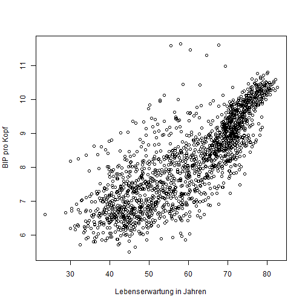

BIP pro Kopf Analyse 
========================================================
author: Simon Hagmann
date: 27.06.2019
autosize: true

Hypothese
========================================================

- Zusammenhang Lebenserwartung und BIP pro Kopf weltweit zwischen 1952 und 2007, alle Länder
- Entwicklung der Lebenserwartung in der Schweiz 1952 - 2007
- Bevölkerungsentwicklung Schweiz 1952 - 2007
- Zusammenhang der Zufriedenheit 


Datenherkunft
========================================================

Verwendete Datensätze

- gapminder
- kaggle - World Bank GDP ranking
- kaggle - World Happiness Report


Summary aus gapminder
========================================================


```r
library(gapminder)
attach(gapminder)
summary(gapminder)
```

```
        country        continent        year         lifeExp     
 Afghanistan:  12   Africa  :624   Min.   :1952   Min.   :23.60  
 Albania    :  12   Americas:300   1st Qu.:1966   1st Qu.:48.20  
 Algeria    :  12   Asia    :396   Median :1980   Median :60.71  
 Angola     :  12   Europe  :360   Mean   :1980   Mean   :59.47  
 Argentina  :  12   Oceania : 24   3rd Qu.:1993   3rd Qu.:70.85  
 Australia  :  12                  Max.   :2007   Max.   :82.60  
 (Other)    :1632                                                
      pop              gdpPercap       
 Min.   :6.001e+04   Min.   :   241.2  
 1st Qu.:2.794e+06   1st Qu.:  1202.1  
 Median :7.024e+06   Median :  3531.8  
 Mean   :2.960e+07   Mean   :  7215.3  
 3rd Qu.:1.959e+07   3rd Qu.:  9325.5  
 Max.   :1.319e+09   Max.   :113523.1  
                                       
```

Zusammenhang Lebenserwartung und BIP pro Kopf weltweit zwischen 1952 und 2007
========================================================




Entwicklung der Lebenserwartung in der Schweiz 1952 - 2007
========================================================


```
processing file: Transferarbeit-Praesentation.Rpres
The following objects are masked from gapminder (pos = 3):

    continent, country, gdpPercap, lifeExp, pop, year

The following objects are masked from gapminder (pos = 4):

    continent, country, gdpPercap, lifeExp, pop, year

The following objects are masked from gapminder (pos = 5):

    continent, country, gdpPercap, lifeExp, pop, year

Quitting from lines 53-60 (Transferarbeit-Praesentation.Rpres) 
Fehler in switzerland$year : $ operator is invalid for atomic vectors
Ruft auf: knit ... withCallingHandlers -> withVisible -> eval -> eval -> plot
Ausführung angehalten
```
